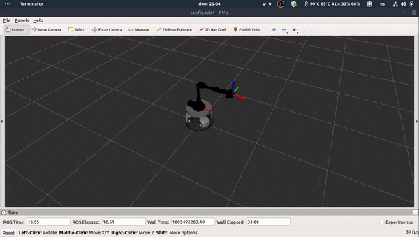

# Control de cuerpo completo en espacio operacional de robots tipo manipulador móvil
 

Paquetes desarrollados como parte de la tesis de pregrado de Jose Manuel Fajardo denominada control de cuerpo completo en espacio operacional de robots tipo manipulador móvil.
 
## Dependencias
 
Los paquetes desarrollados necesitan tener instaladas las librerías Eigen y DART de C++. Para instalarlas se pueden utilizar los comandos:
 
<code> sudo apt-get install libeigen3-dev</code>
 
<code> sudo apt-add-repository ppa:dartsim/ppa </code>

<code>sudo apt-get update  </code>

<code>sudo apt-get install libdart6-dev </code>

 
Además de las anteriores librerías, se utilizaron los paquetes de ROS-Control y robot_localization. Para instalarlos se puede utilizar los siguientes comandos:
 
<code>sudo apt-get install ros-melodic-ros-control</code>

<code>sudo apt-get install ros-melodic-ros-controllers</code>
 
<code>sudo apt-get install ros-melodic-robot-localization</code>
 
## Compilación
 
Para compilar el código se recomienda utilizar la herramienta catkin_tools, la cual puede ser instalada utilizando los comandos:
 
<code>sudo sh -c 'echo "deb http://packages.ros.org/ros/ubuntu `lsb_release -sc` main" > /etc/apt/sources.list.d/ros-latest.list'  </code>

<code>wget http://packages.ros.org/ros.key -O - | sudo apt-key add - </code>

<code>sudo apt-get update  </code>

<code>sudo apt-get install python-catkin-tools</code>
 
Con esta herramienta se recomienda compilar los paquetes utilizando máximo la mitad de los hilos disponibles de CPU, utilizando el modificador -j. Como ejemplo, en caso de que se tengan ocho hilos disponibles se debe utilizar el siguiente comando estando dentro del workspace.
 
<code>catkin build -j 4</code>
 
## Uso
 
Para el uso se debe iniciar el simulador y cargar el modelo a través del comando:
 
<code>roslaunch mobile_manipulator_unal_description gazebo_view.launch </code>
 
Después se debe iniciar el controlador utilizando el comando:
 
<code>roslaunch mob_manipulator_controller osc_controller.launch</code>
 
Teniendo el controlador se puede pasar a publicar la trayectoria deseada en el tópico */mobile_manipulator/desired_traj* y suscribirse al tópico de información del robot */mobile_manipulator/data*.
 
## Parámetros
 
TODO

